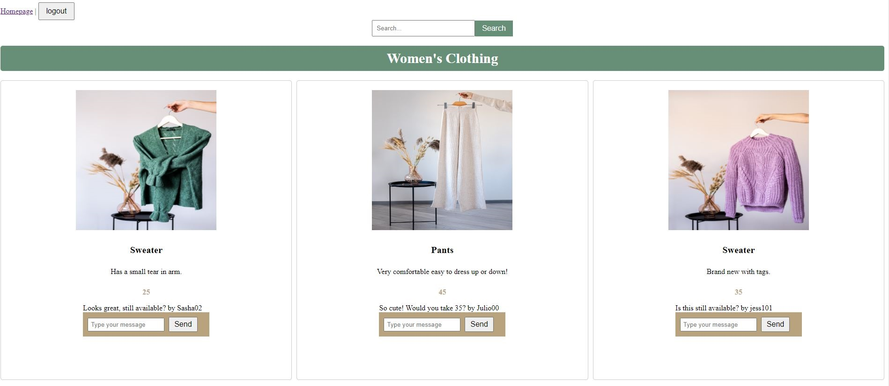

# Nifty Thrifty 

## Description 
When shopping for clothes, it can be hard to not only find a deal but know that what you are buying is environmentally friendly. Buying second-hand is the best way to do both! With Nifty Thrifty, a user can upload, post and share their clothing to other users.  

## Usage 



To use Nifty Thrifty, simply sign up or log in and you'll be presented with a homepage filled with products posted by different users. 

Check it out here <a href=""></a>

## User Story 

```
AS A consumer 
I WANT to buy second hand
SO THAT I can spend less and help the environment 
```

## Technologies Used
-Cloudinary (photo upload)

-MySQL

-Sequelize

-Express

-Handlebars

## Credits

Front-End - <a href="https://github.com/Kdubb219">Kyla Wise</a> & <a href="https://github.com/TiffanySwank">Tiffany Swank</a>

Back-End - <a href="https://github.com/afrazier01">Aveontae Frazier</a>, <a href="https://github.com/UtuRaiden">Barron Peterson</a>, <a href="https://github.com/IvySMac">Ivy McCurdy</a> 
